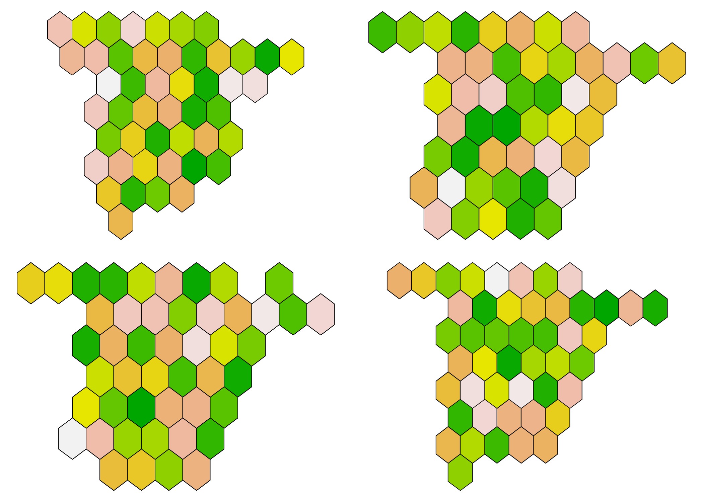
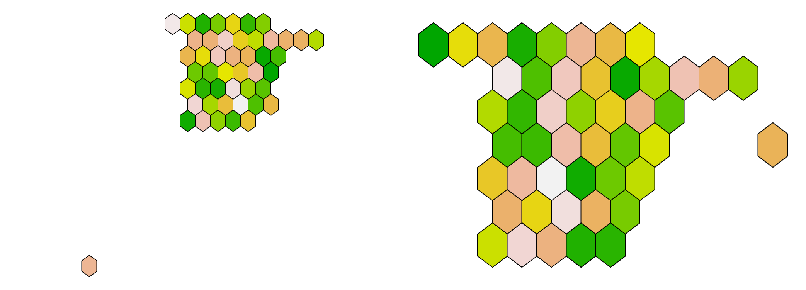

---
output:
  md_document:
    variant: gfm
    toc: true
    toc_depth: 2
---

```{r, echo = FALSE}
knitr::opts_chunk$set(
  collapse = TRUE,
  comment = "#>",
  fig.path = "README-",
  dpi=300,fig.width=7
)
```

# Mapa hexagonal de España peninsular

**Objetivo**: hacer un mapa hexagonal de la España peninsular con un hexágono para cada provincia.

Basado en: https://danielredondo.com/posts/20180723_granada_hex/

Inspirado por @r_vaquerizo: https://twitter.com/r_vaquerizo/status/1324262975147040769

# Carga de paquetes y descarga de datos

```{r,warning=F,message=F}
library(dplyr)
library(ggplot2)
library(sf)
library(raster)

esp <- getData('GADM', country = "Spain", level = 0)
plot(esp)
```

# Mapa básico

Se utiliza un muestreo de tipo hexagonal dentro del mapa de España.

```{r,warning=F,message=F}
set.seed(2020)
hex_points <- esp %>% spsample(type = "hexagonal", cellsize = 1.10)
# Número de hexágonos = length(hex_points@coords)/2
while(length(hex_points@coords)/2 != 47){
  hex_points <- esp %>% spsample(type = "hexagonal", cellsize = 1.10)
  cat(paste0(length(hex_points@coords)/2), "... ")
}
esp_hex <- HexPoints2SpatialPolygons(hex_points, dx = 1.1)

# Mapa superpuesto
ggplot() +
  geom_sf(data = st_as_sf(esp)) +
  geom_sf(data = st_as_sf(esp_hex), colour = "black", fill = NA)
# Mapa con hexágonos
ggplot() +
  geom_sf(data = st_as_sf(esp_hex), colour = "black", fill = sample(terrain.colors(47, 1))) +
  theme_void()
```

# Distintas disposiciones de hexágonos

```{r, eval = FALSE}
for(semilla in 1:30){
  print(semilla)
  set.seed(semilla)
  hex_points <- esp %>% spsample(type = "hexagonal", cellsize = 1.10)
  
  # Número de hexágonos = length(hex_points@coords)/2
  while(length(hex_points@coords)/2 != 47){
    hex_points <- esp %>% spsample(type = "hexagonal", cellsize = 1.10)
    cat(paste0(length(hex_points@coords)/2), "... ")
  }
  esp_hex <- HexPoints2SpatialPolygons(hex_points, dx = 1.1)
  
  # Mapa superpuesto
  ggplot() +
    geom_sf(data = st_as_sf(esp)) +
    geom_sf(data = st_as_sf(esp_hex), colour = "black", fill = NA)
  ggsave(paste0("mapa_", semilla, ".png"), width = 7, height = 5)
  
  # Mapa con hexágonos
  ggplot() +
    geom_sf(data = st_as_sf(esp_hex), colour = "black", fill = sample(terrain.colors(47, 1))) +
    theme_void()
  ggsave(paste0("mapa_hexagonos_", semilla, ".png"), width = 7, height = 5)
}
```

Algunos mapas generados:  



Algunos hay que descartarlos porque algún hexágono se genera en Baleares o Canarias. 



Esto se puede evitar modificando `esp` o utilizando un fichero distinto (.SHP por ejemplo).

# Con otro tamaño de hexágonos 

```{r,warning=F,message=F}
set.seed(2)
hex_points <- esp %>% spsample(type = "hexagonal", cellsize = 1.1)
# Número de hexágonos = length(hex_points@coords)/2
while(length(hex_points@coords)/2 != 47){
  hex_points <- esp %>% spsample(type = "hexagonal", cellsize = 1.1)
  cat(paste0(length(hex_points@coords)/2), "... ")
}
esp_hex <- HexPoints2SpatialPolygons(hex_points, dx = 1.05)

# Mapa superpuesto
ggplot() +
  geom_sf(data = st_as_sf(esp)) +
  geom_sf(data = st_as_sf(esp_hex), colour = "black", fill = NA)
# Mapa con hexágonos
ggplot() +
  geom_sf(data = st_as_sf(esp_hex), colour = "black", fill = sample(terrain.colors(47, 1))) +
  theme_void()
```